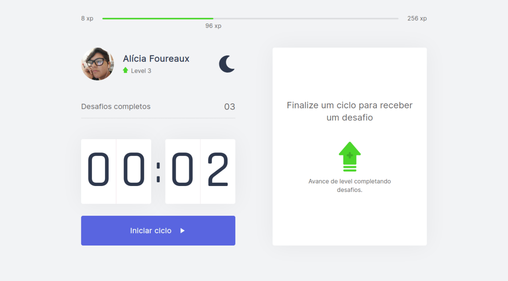

<h1 align="center">🏆 Move.It Next</h1>

 React track project from the fourth edition of #NLW. 

 

 

## 💡 What is it?
Move.It is a project made during the fourth edition of NLW provided by @Rocketseat on the ReactJS track. We learned a library for React called NextJS and how to create an entire project with it.

## 🖥 Setup
- Clone the repository
- Run `npm install` to install dependecies
- Run `npm run dev` to run the project

## 🚧 Built With
- NextJS
- TypeScript